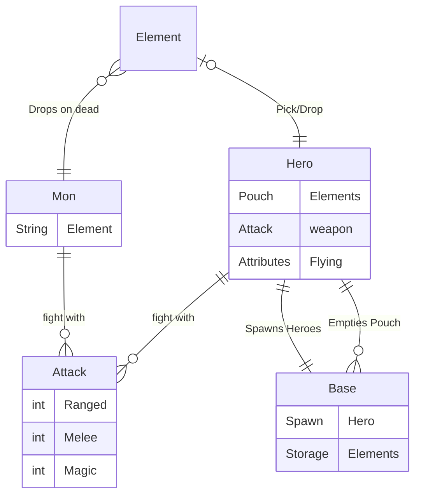

```mermaid
erDiagram
  Hero {
    Pouch Elements
    Attack weapon
    Attributes Flying
  }
  Attack {
    int Ranged
    int Melee
    int Magic
  }
  Mon {
    String Element
  }
  Base {
    Spawn Hero
    Storage Elements
  }

  Hero ||--}o Base : "Empties Pouch"
  Base ||--|| Hero : "Spawns Heroes"

  Hero ||--}o Attack : "fight with"
  Mon ||--}o Attack : "fight with"

  Element }o--|| Mon : "Drops on dead"
  Element |o--|| Hero : "Pick/Drop"
```
